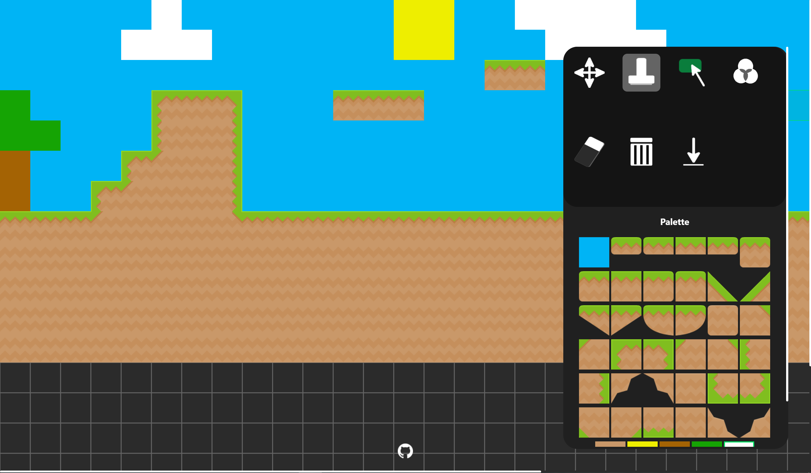

# Tiles
Check out Tiles [here](https://google.ca).

### What is Tiles ? 

Tiles is lightweight online Tile Editor. 
- **Customize the dimensions of your grid** by specifying your row count,
column count as well as cell size.
- **Upload tiles of your own** to add to your palette at any moment. Or you can use the preset tiles already provided.
- **Download your designed level as a CSV file** once you're done. 

### Tech Stack

- React web application bootstrapped with **create-react-app**.
- Hosted on **firebase**.
